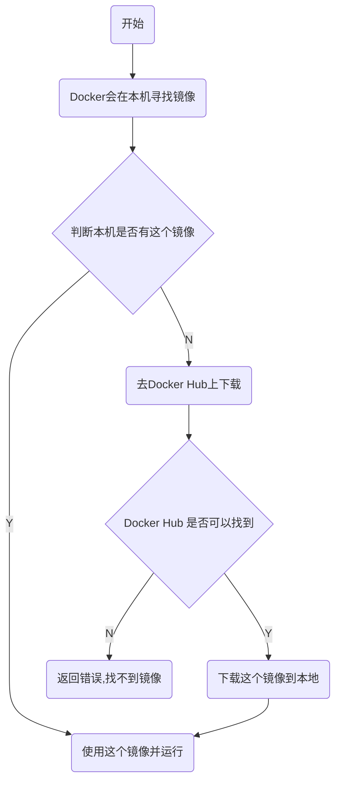

```mermaid
graph TB

A(开始) --> B(Docker会在本机寻找镜像)
	B --> C{判断本机是否有这个镜像}
	C --> |Y| D(使用这个镜像并运行)
	C --> |N| E(去Docker Hub上下载)
	E --> F{Docker Hub 是否可以找到}
		F -->|Y| G(下载这个镜像到本地)
		G --> D
		F -->|N| H(返回错误,找不到镜像)
	

```

