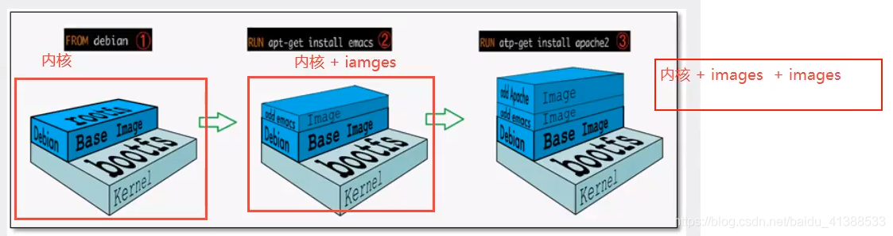

### Docker 镜像原理

---

#### 镜像是什么

镜像是一种轻量级、可执行的独立软件包，用来打包软件运行环境和基于运行环境开发的软件，它包含运行某个软件所需的所有内容，包括代码、运行时、库、环境变量和配置文件。

所有的应用，直接打包docker镜像，就可以直接跑起来！

得到镜像的方式：

- 从远程仓库下载
- 同事拷贝给你
- 自己制作一个镜像DockerFile


### Docker镜像加载原理

>UnionFS(联合文件系统)

- 是一种**分层、轻量级并且高性能的文件系统**，它支持对文件系统的修改，**作为一次提交来一层层的叠加**，同时可以将不同目录挂载到同一个虚拟文件系统下（unite directories into a single virtual filesystem）。

- UnionFS是Docker镜像的基础，**镜像可以通过分层来继承，基于基础镜像（没有父镜像的镜像），可以制作各种具体的应用镜像**

  特性：**一次同时加载多个文件系统**，但从外面看起来只能看到一个文件系统，联合加载会把各层文件系统叠加起来，这样最终的文件系统会包含所有底层的文件和目录

- 例子：比如说 mysql 和 tomcat 都需要 centos 环境，先安装了 mysql ，就有了 centos 的环境，那再安装 tomcat ，就可以共用这一层 centos ，不需要再下载 centos 。

#### 分层镜像例子：

```shell
# 先下载nginx 
[root@VM_0_10_centos ~]# docker pull nginx
Using default tag: latest
latest: Pulling from library/nginx
bb79b6b2107f: Pull complete 
111447d5894d: Pull complete 
a95689b8e6cb: Pull complete 
1a0022e444c2: Pull complete 
32b7488a3833: Pull complete 
Digest: sha256:ed7f815851b5299f616220a63edac69a4cc200e7f536a56e421988da82e44ed8
Status: Downloaded newer image for nginx:latest
docker.io/library/nginx:latest

# 然后拉取redis的镜像 
[root@VM_0_10_centos ~]# docker pull redis
Using default tag: latest
latest: Pulling from library/redis
bb79b6b2107f: Already exists 		# 这一层镜像在拉取nginx的时候下载过，不需要再次下载
1ed3521a5dcb: Pull complete 
5999b99cee8f: Pull complete 
dd17877d8f2d: Pull complete 
4863b56b12a8: Pull complete 
069e700bc397: Pull complete 
Digest: sha256:a0494b60a0bc6de161d26dc2d2f9d2f1c5435e86a9e5d48862a161131affa6bd
Status: Downloaded newer image for redis:latest
docker.io/library/redis:latest
```

优点：**资源共享**。多个镜像都从相同的 base 镜像构建而来，那么宿主机只需要在磁盘上保留一份 base 镜像，同时内存中也只需要加载一份 base 镜像，这样就可以为所有的容器服务了，而且镜像的每一层都可以被共享。


### **Docker 镜像加载原理**

- Docker的镜像实际上**由一层一层的文件系统组成**，这种层级的文件系统UnionFS。
- **BootFS（Boot file system）**主要包含 bootloader 和 kernel，bootloader 主要是引导加载 kernel，Linux 刚启动时会加载 BootFS文件系统，在 Docker 镜像的最底层是 BootFS。这一层与我们典型的 Linux/Unix 系统是一样的，包含 boot 加载器 和 内核。当 boot 加载完成之后整个内核就都在内存中了，此时内存的使用权已由 BootFS 转交给内核，此时系统也会卸载 BootFS。
- **RootFS（Root File System）**，在 BootFS 之上，包含的就是典型 Linux 系统中的 /dev，/proc，/bin，/etc 等标准目录和文件。RootFS就是各种不同的操作系统发行版，比如 Ubuntu CentOS 等等。

